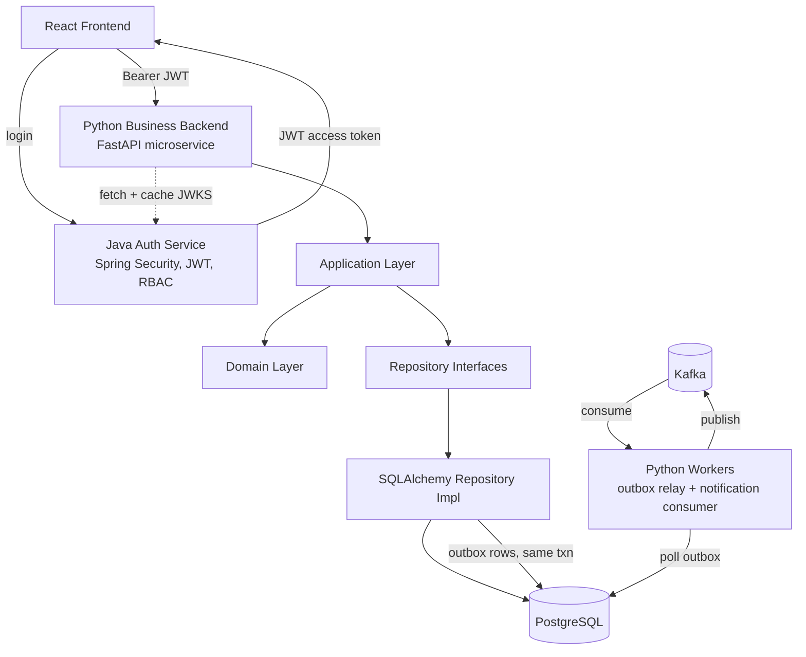
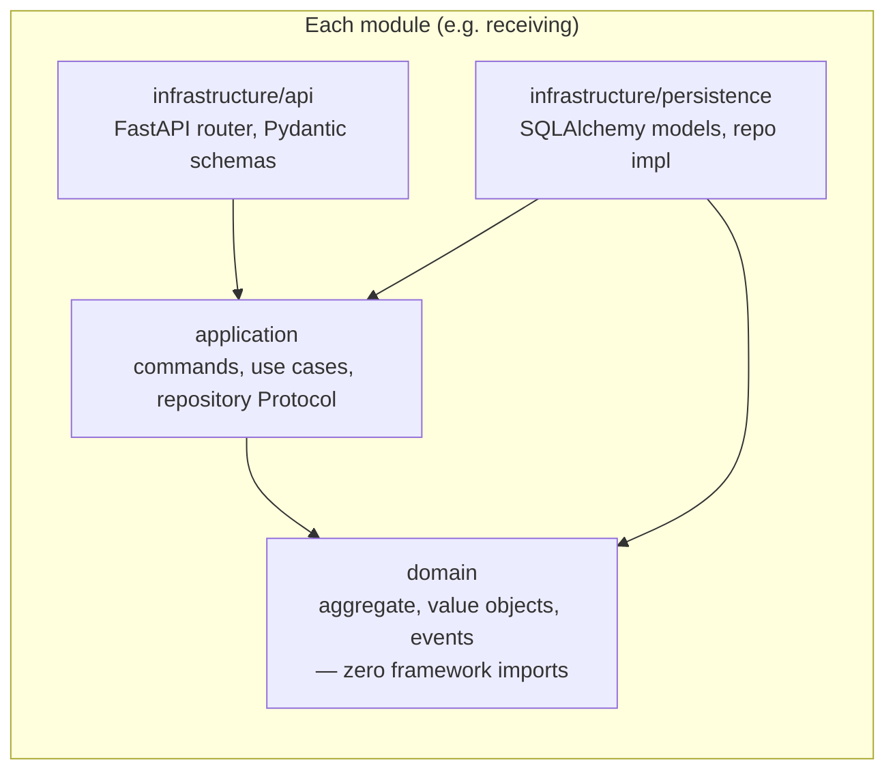
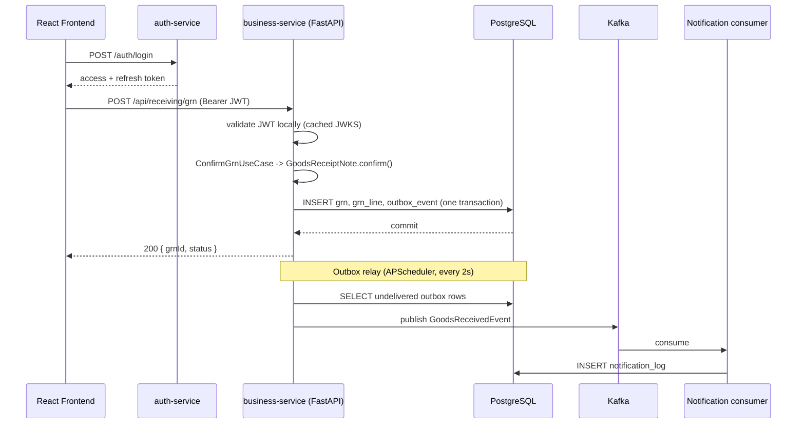
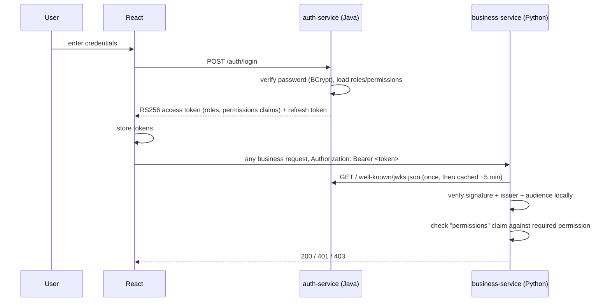
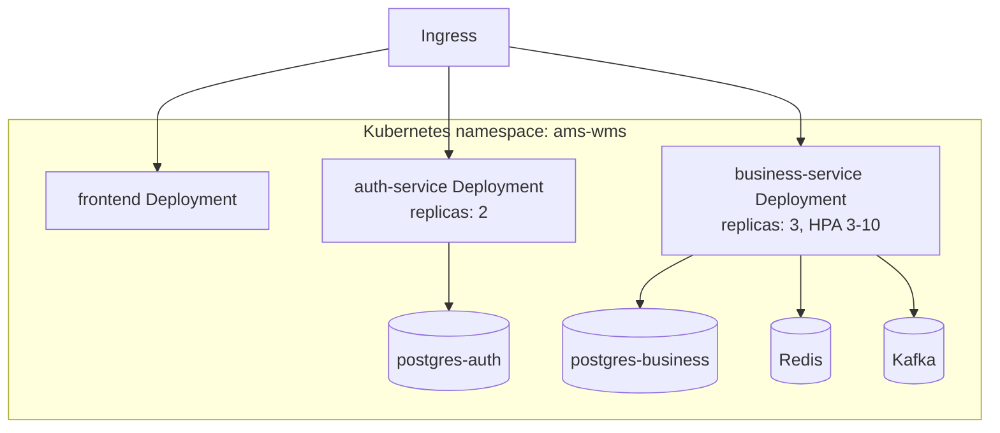
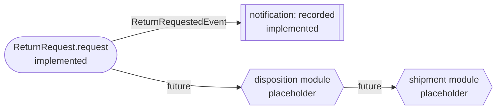
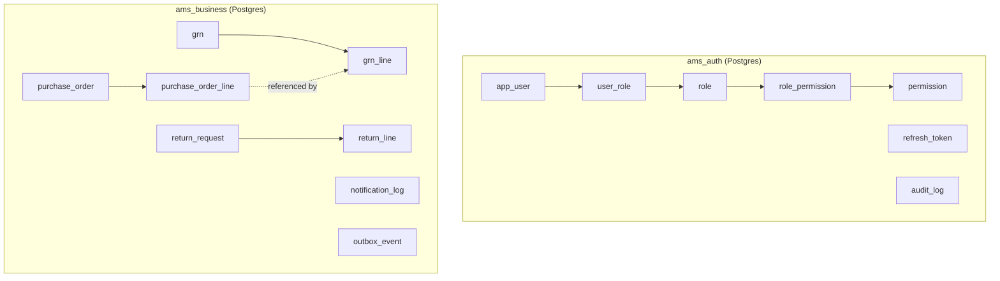
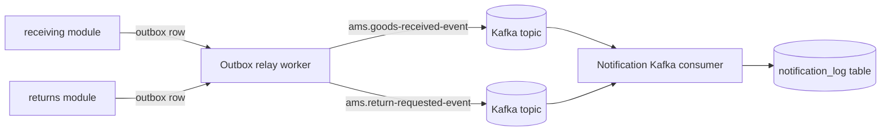

# Architecture

Post-migration, the platform splits into two backend deployables plus the
frontend:

- **auth-service** (Java/Spring Boot) — authentication, authorization,
  RBAC, JWT issuance, refresh tokens, user management, audit logs. No
  business logic.
- **business-service** (Python/FastAPI) — every business module
  (receiving, returns, notification today; quality, storage, assembly,
  dispatch, procurement, gate, disposition, shipment, traceability,
  masterdata, erp, approval as placeholders — see each module's
  `MIGRATION_NOTES.md`).
- **frontend** (React/Vite/TypeScript) — unchanged in spirit; now calls two
  backends instead of one per business module.

## Overall architecture

## Package diagram (business-service)

## Sequence: confirm a goods receipt (request flow)

## Authentication flow

## Deployment diagram

## Business flow: return request lifecycle (current + placeholder modules)

## Database flow

## Kafka flow

